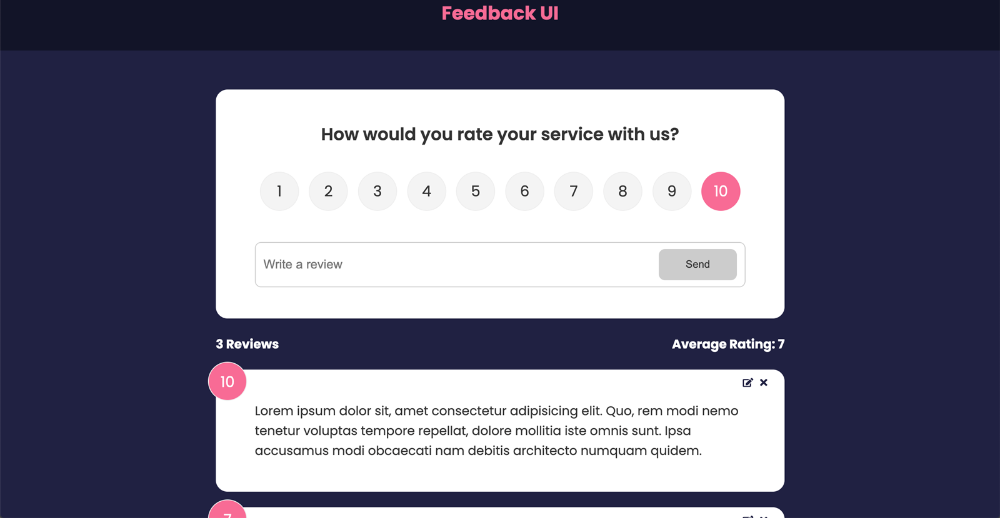

# React Feedback App

This is a project from [Udemy - React Front To Back 2022](https://www.udemy.com/course/react-front-to-back-2022/) by Travery Media.

## Table of contents

- [Overview](#overview)
  - [Acceptance Criteria](#acceptance-criteria)
  - [Screenshot](#screenshot)
  - [Links](#links)
- [My process](#my-process)
  - [Built with](#built-with)
  - [What I learned](#what-i-learned)
- [Author](#author)

## Overview

### Acceptance Criteria

Users should be able to:

- Add a new feedback item using the form
- Delete a feedback item
- Edit an existing feedback in the feedback list
- Navigate to the about page & back
- See the feedback stats change when the feedback list changes

### Screenshot

### Links

- Live Site URL: [Live Site](https://gregarious-custard-53a7d3.netlify.app/)

## My process

### Built with

- Create React App
- React Router Dom
- Framer Motion
- UUID
- React Icons

### What I learned

I learned how to first build this project by passing functions, state, and other data via props. This is otherwise known as 'prop-drilling,' and is fine for small projects. However it starts to get messy when the application grows in complexity.

Later in the project, I learned how to refactor the code to use context (instead of prop-drilling) for functions and global state. This cleaned things up quite a bit, especially in the `src/app.js` file.

Finally, I got some practice with using external NPM dependencies like React Router Dom for creating routes, Framer Motion for feedback list animation, and UUID for generating unique id's for each feedback item.

## Steps To Run App

- Clone the repo onto local machine
- Navigate to project directory in Terminal, then: `npm install` to install project dependencies
- Terminal: `npm start`

## Author

- Website - [Chris Korsak](https://www.chriskorsak.net)
- Udemy - React Front To Back 2022 - [Traversy Media](https://www.udemy.com/course/react-front-to-back-2022/)
